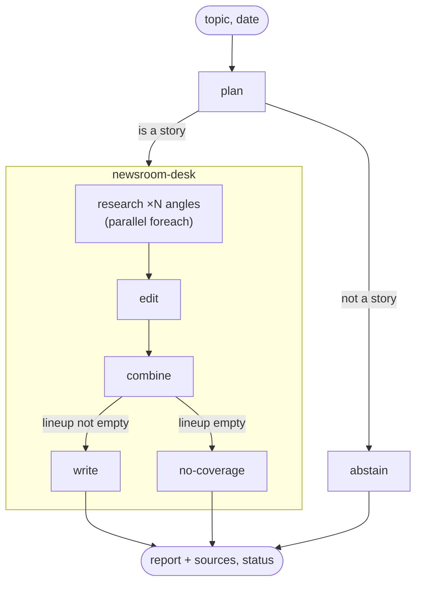

# Mastra Newsroom

**Give it a topic and a date, get that day's sourced news brief.**

A small newsroom of five agents runs inside one Mastra workflow. A planner splits the topic into angles, researchers search the day's news in parallel, an editor picks the stories, and a reporter writes a cited brief. Five scorers and two datasets grade the output. Every step is visible in Mastra Studio. The brief this project answers is in [task.md](task.md).

## Prerequisites

- **Node.js 22.13 or later**
- **[OpenAI API key](https://platform.openai.com/api-keys)**: set as `OPENAI_API_KEY`. It is used by all five agents and the `brief-correctness` judge.
- **[Exa API key](https://dashboard.exa.ai/api-keys)**: set as `EXA_API_KEY`. It is used for news search and for reading articles.

## Quickstart 🚀

1. **Install dependencies**: `npm install`
2. **Add your API keys**: `cp .env.example .env`, then fill in `OPENAI_API_KEY` and `EXA_API_KEY`.
3. **Seed the datasets**: `npm run seed` creates `routing` and `launch-days`. Run it while the dev server is stopped, because both open the same database. Reseeding replaces the datasets and their past experiments.
4. **Start the dev server**: `npm run dev` starts Studio at [localhost:4111](http://localhost:4111) and the web UI at [localhost:3000](http://localhost:3000).

   To start one of them alone, use `npm run dev:mastra` (Studio) or `npm run dev:web` (the web UI, which waits for a running `mastra dev`).

A story run takes 85–105 s and costs about $0.05–0.10.

## Try it out

**1. Ask the editor.** Open **Agents → Editor-in-chief** and ask:

> what's happening with AI regulation?

It turns the question into a short topic, runs the `news-report` workflow as a tool, and relays the brief. You can chat with the other four agents directly too.

**2. Run the workflow and inspect each step.** Open **Workflows → news-report** and run:

```json
{ "topic": "smart glasses", "date": "2026-09-24" }
```

You can inspect every step's input, output and state, including the steps inside the nested `newsroom-desk`. The three live scorers attach to `write`, and their results appear under **Scorers**. The `date` is optional and defaults to today in UTC.

**3. Take the other two routes.**

- `{ "topic": "my neighbour's dog" }`: the planner decides this is not a story, and the run ends at `abstain` with `status: "invalid-topic"`.
- `{ "topic": "Tuvalu library budget", "date": "2026-09-08" }`: the planner accepts the topic, but the desk finds no coverage and returns `status: "no-coverage"` without writing anything.

**4. Run an experiment.** Open **Datasets → Launch days → Run experiment**. Each item runs the full workflow, and `brief-correctness` checks the brief against a hand-written answer key. **Routing** is the cheap one to try first: its three non-subjects stop at the planner.

**5. Read the traces.** **Observability** shows the agent calls, tool calls and workflow spans for every run.

**6. Or use the web UI.** At [localhost:3000](http://localhost:3000), start a run, watch the steps stream in, and read the brief with numbered source cards. It talks to the same server, so it shows the same runs as Studio.

## How it works



1. **Plan.** The planner decides whether a newsroom could report on this topic on that day. If it could, it splits the topic into 1–5 research angles, adding a new angle only when the topic has a genuinely distinct thread.
2. **Research.** One researcher per angle runs in parallel. Each one searches the day's news with `exa-news-tool`, judges relevance from titles and highlights, and groups hits into stories. It returns article ids, not urls.
3. **Edit.** The news editor sees every story from every angle. It merges stories that describe the same event and marks each one cover, brief or drop.
4. **Combine.** Code resolves the editor's picks to articles, removes duplicates, and orders the cover stories by how many distinct outlets reported them. An empty lineup goes to `no-coverage`.
5. **Write.** The reporter opens up to six articles in full with `read-article` and writes the brief with `[n]` citations. Code turns the citations into links and appends the sources.

| Agent | Role | Model |
|---|---|---|
| `editor-in-chief` | Chat front door. Turns a question into a topic, runs the workflow, relays the report or explains an abstain. | `gpt-6-luna` |
| `planner` | Decides whether it is a story and splits it into angles. | `gpt-6-sol` |
| `researcher` | Searches one angle and groups hits into stories. | `gpt-6-luna` |
| `news-editor` | Merges duplicate stories and decides cover, brief or drop. | `gpt-6-luna` |
| `reporter` | Reads the chosen articles and writes the cited brief. | `gpt-6-luna` |

The planner gets the stronger model because its short output shapes every step after it. Both models are set in `src/mastra/model.ts`.

Every route returns the same shape, `outputSchema` in `src/mastra/types.ts`:

```ts
{ topic, date, status: 'ok' | 'invalid-topic' | 'no-coverage', report, sources, lineup, research }
```

<details>
<summary><b>Step-by-step reference</b></summary>

| Step | Role | What it does |
|---|---|---|
| `plan` | planner (agent) | Is this a story a newsroom could report on that day? Splits it into 1–5 research angles, only where the topic has genuinely distinct threads. |
| `research` | researcher (agent + `exa-news-tool`) | One per angle, `foreach` with all angles in parallel. Searches the day's news, judges relevance from titles and highlights, groups hits into stories. Returns article ids only. |
| `edit` | news-editor (agent) | Sees a flat story list (id, headline, angle, outlets, two highlights). Merges the same event found by different angles; decides cover / brief / drop. |
| `combine` | code | Resolves groups to articles, dedupes by id, orders covers by distinct outlets, then briefs. If the editor returns no groups, researcher stories pass through (2+ outlets = cover). |
| `write` | reporter (agent + `read-article`) | Opens up to six articles in full by id. One paragraph per cover, one bullet per brief, cites `[n]`. Code turns `[n]` into `[n](url)` and appends a Sources list. Live scorers are attached here. |
| `no-coverage` | code | The lineup is empty. Returns `no-coverage` without a model call. |
| `abstain` | code | The planner said it is not a story. Returns `invalid-topic` with the planner's reason. |
| `merge-desk`, `merge` | code | Pass through whichever arm ran, keyed by arm id. There is one after each branch. |

</details>

<details>
<summary><b>What the brief looks like</b></summary>

`report` is standalone markdown in daily-brief form. The rules are drawn from Axios Smart Brevity, Semafor Flagship and The Economist Espresso. In order, it contains:

- A headline.
- A bold dateline built by code, e.g. `Nvidia desk · Wednesday, September 23, 2026`.
- A "Today in one line" summary.
- One numbered `##` section per cover story. Each opens with a bold fact and uses up to three fixed labels: Why it matters, By the numbers, What's next.
- Briefs as labelled bullets under "In brief".
- "What to watch", then `## Sources`.

Story 1 gets 80–120 words and the rest get 50–80 each. The whole brief stays under 700 words. Citations are `[n](url)` links into the Sources list. `lineup` and `research` hold the story data that the scorers read.

</details>

<details>
<summary><b>Design notes</b></summary>

- **Root zod types.** `src/mastra/types.ts` holds the schemas. Steps, tools, structured output and scorers all derive from them.
- **Ids, not urls.** Each article gets an 8-character id from a sha1 of its url. Researchers pick by id, the reporter cites by number and opens by id, and code maps ids back to urls. In an earlier build, models were seen "completing" long urls.
- **The workflow owns the day.** Steps put the date in the request context. `exa-news-tool` declares `requestContextSchema` and reads it from there. The tool also takes an optional `startDate` / `endDate`, so a look-back window can be A/B tested as an experiment. `read-article` gets the lineup's article map the same way.
- **Branch, not `bail()`,** so both routes are visible in the Studio graph and each has a schema. Declarative predicates such as `{ op: 'truthy', value: { path: 'inputData.isStory' } }` show as readable conditions. `merge` is keyed by arm id, the idiom from Mastra's KYC template.
- **Workflow state** (`stateSchema`) carries the researchers' output from `edit` to `combine` and `write`, instead of re-reading a `foreach` result with a cast.
- **Caps live in the prompt and in code, not in zod `.max()`.** A hard schema cap fails the whole step when a model goes over by one. Angles are sliced to 5 in code, and the research and reporter runs have `maxSteps`.
- **No counters in data shapes.** Scorers derive what they need from the output.
- **Experiments target the workflow.** Mastra's examples target agents. Here the report is the output of the whole pipeline, so the workflow is what gets graded.

</details>

## Evals

Where a scorer runs follows one rule. If the output alone can answer its question, it runs **live** on `write` for every story run. If it needs an answer key (`groundTruth`), it runs only in **experiments**, on a dataset whose items carry that key.

**Live scorers** (on `write`):

| Scorer | Question | Typical score |
|---|---|---|
| `citation-fidelity` | Does every citation point at a source that was actually fetched? | 1.0 |
| `research-redundancy` | Did the planner's angles find different stories? | 0.6–0.89 |
| `coverage` | Did every story reported by 2+ outlets make the lineup? | 0.91–1.0 |

**Experiment scorers** (against ground truth):

| Scorer | Question |
|---|---|
| `status` | Did the run take the expected route (`ok`, `no-coverage` or `invalid-topic`)? |
| `brief-correctness` | Does the brief say everything in `must` and nothing in `mustNot`? This is an LLM judge. |

**Datasets** (both target the `newsReport` workflow):

| Dataset | Question | Items | Scorers |
|---|---|---|---|
| `routing` | Does each topic take the right route? | 8 | `status` |
| `launch-days` | On a day with a known big story, does the brief carry it? | 5 | `brief-correctness`, `status` |

<details>
<summary><b>Scorer details</b></summary>

All scorers are typed `createScorer<unknown, Output>` and registered on the Mastra instance, so datasets and experiments can name them by id.

| Scorer | Reads | Score |
|---|---|---|
| `citation-fidelity` | `report`, `sources` | 1 minus the share of citations in the body (links and unresolved `[n]`) that do not point at a fetched source. |
| `research-redundancy` | `lineup[].storyIds` | 1 minus the share of lineup stories found by more than one angle. Story ids are `a<angle>-s<n>`, so the prefix gives the angle. It judges the planner's split. |
| `coverage` | `research`, `lineup` | The share of researcher stories with 2+ outlets that made the lineup. Dropping a multi-outlet story counts as a miss. |
| `status` | `status`, `groundTruth.expectedStatus` | 1 if the run took the expected route, else 0. Plain code. |
| `brief-correctness` | report body, `groundTruth.must` / `mustNot` | LLM judge (`gpt-6-luna`), following the pattern from Mastra's eval-loop guide. 1 if every `must` sentence holds and no `mustNot` sentence does, judged on meaning rather than wording. |

**Why the live scorers skip no-coverage runs.** A no-coverage run has nothing to cite, dedupe or cover, so every live scorer would give it a meaningless 1. The desk branches after `combine`, which means an empty lineup never reaches `write`, where the scorers are attached. For the same reason, the scorers sit on `write` rather than `merge`, so abstain routes don't produce 1.0 rows either.

</details>

<details>
<summary><b>Dataset details</b></summary>

Each dataset answers one question. `startExperiment` always runs every item, so a dataset is also the unit you choose to run. All items in a dataset share one `groundTruth` shape, and the dataset carries its own scorer list (`scorerIds`), so every scorer applies to every item. The datasets list only ground-truth scorers, because the live scorers already run on `write` in every experiment run.

**`routing`**: `groundTruth: { expectedStatus }`

- 2 busy beats that should come back `ok`.
- 3 real subjects with no news on their date, which should come back `no-coverage`.
- 3 non-subjects, which should come back `invalid-topic`.

Every item has a fixed date in September 2026, so reruns search the same news.

**`launch-days`**: `groundTruth: { expectedStatus: "ok", must, mustNot }`

| Topic | Date | Story it must carry |
|---|---|---|
| `phone` | 2026-09-09 | iPhone Duo |
| `new AI models` | 2026-09-16 | TypeSafe's Jev |
| `new AI models` | 2026-09-03 | GPT-6 Astra |
| `smart glasses` | 2026-09-24 | Meta Connect |
| `Android` | 2026-09-01 | September Android Drop |

Each date is the UTC day most of the coverage was published, checked against Exa. A US afternoon or evening announcement, such as Meta's 4pm PT keynote or TypeSafe's Sep 15 launch, is dated the next day. The broad topics are deliberate: on Jev's day, `new AI models` does not surface Jev in the top ten search results, so the planner has to find it.

</details>

## Web UI

`web/` is a small Next.js app (an npm workspace) on top of the same Mastra server, styled with Studio's own tokens and fonts. It has no database of its own. It talks to `mastra dev` through `@mastra/client-js`. If Mastra is not on `http://localhost:4111`, set `NEXT_PUBLIC_MASTRA_URL` in `web/.env`.

<details>
<summary><b>How it uses the Mastra client</b></summary>

- **Run history**: `GET /newsroom/runs`, a custom Mastra route in `src/mastra/routes/run-summaries.ts`. Mastra's own run list returns every run's full snapshot, so this route slims it down to one line per run before it leaves the server.
- **New run**: `createRun()`, then `run.stream({ inputData })`. Step events drive the timeline. Nested desk steps stream with dotted ids such as `newsroom-desk.research`, and the research `foreach` emits progress for each angle.
- **Refreshing mid-run**: the page reattaches with `run.observe()`, which replays the run's cached events and then continues live. Closing the tab does not stop the run. If the event cache is gone because the server restarted, it falls back to polling `runById` every 3 s, as Studio does.
- **Result**: `runById(runId, { fields: ["result", "error", "payload", "steps"] })`. Markdown is rendered with `react-markdown` + `remark-gfm`, and sources are shown as cards numbered to match the `[n]` citations. Failed runs show the stored error. `invalid-topic` and `no-coverage` runs show the planner's or the workflow's message.

</details>

## Project layout

```
src/mastra/
  index.ts          Mastra instance: agents, tools, workflows, scorers, storage, observability
  model.ts          model ids
  types.ts          zod schemas every step, tool and scorer derives from
  agents/           editor-in-chief, planner, researcher, news-editor, reporter
  tools/            exa-news-tool, read-article
  workflows/        news-report (+ nested newsroom-desk)
  scorers/          citation-fidelity, research-redundancy, coverage, status, brief-correctness
  routes/           run-summaries (custom API route for the web UI)
scripts/
  seed-dataset.ts   creates the routing and launch-days datasets
web/                Next.js UI
```

**Storage.** Datasets, runs and scores go to LibSQL (`mastra.db`). Traces go to DuckDB (`mastra.duckdb`), because Studio's trace list uses trace queries that LibSQL does not implement. Both paths are relative to the process's working directory. `mastra dev` runs the server from `src/mastra/public/`, so both files live there (gitignored), and the seed script `chdir`s there before loading Mastra so that it opens the same files.

## Limitations

- There is no auth. This is a local demo bound to localhost.
- The date defaults to today in UTC. Early in the UTC day there is little news yet.
- Relevance and grouping are the model's judgement from titles and highlights. A `no-coverage` routing item can turn `ok` if a researcher accepts a loosely related hit. On their pinned dates, Exa returns only off-topic articles for these items.
- `citation-fidelity` checks that a link points at a fetched source, not that the source supports the sentence.
- `research-redundancy` is still 0.6–0.89 on broad topics, because the planner's angles overlap.
- `launch-days` has one hand-labelled answer key per item. Dates nobody labelled get no recall check, and the live scorers only check citations and internal consistency.

## Roadmap

1. Tune the planner's catch-all angle, measured with `research-redundancy` as the first experiment.
2. Give the editor a look-back tool without a date filter, so a thin day can be framed against last week.
3. Add multi-day memory so tomorrow's report does not repeat today's stories.
4. Add an LLM judge scorer for "each claim is supported by the cited article".
5. Measure the effect of the 1000-character highlight cap and full research concurrency against the 5-item baseline.
